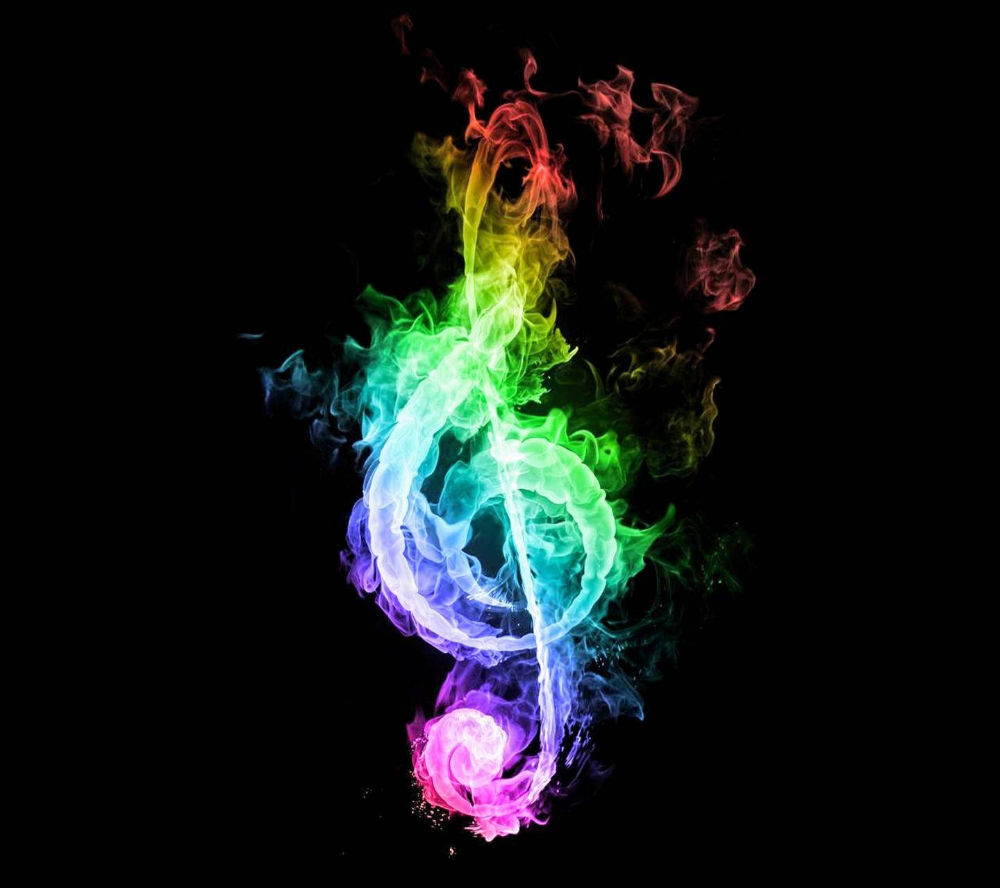

# Aarish Alam
Portfolio to demonstrate Data-Science Projects

- **Email**: [arishalam121@gmail.com](arishalam121@gmail.com)
- **LinkedIn**: [linkedin/aarish-alam](www.linkedin.com/in/aarish-alam)
- **Kaggle**: [kaggle/arishalam](https://www.kaggle.com/arishalam)
- **Medium**: [medium/arishalam](https://arishalam121.medium.com/)

## Projects

 **[AskDoc](https://github.com/noobknights/askdoc)**

This project was developed as a hackathon project, implemented a vote classifier(using Algorithms:SVM,Random Forest,Gradient Boosting,Logistic Regression) based upon hard voting which classifies user's query into most pobable disease.
 
 
 
 **[Movie Recommendation App](https://github.com/RheagalFire/Content_Based_Filtering)**

This is a deployed app which suggests movies based on the similarity of their content. The similarity metric that was used is cosine similarity.
 
 
 
 
 **[Book Recommendation Engine](https://github.com/RheagalFire/Book-Recommendation-Engine)**

Built a book recommendation engine using collaborative filtering technique with k-means clustering.The similarity in taste of two users is calculated based on the similarity in the rating history of the users.
 
 
 
 
 **[Sign Language Detection](https://github.com/RheagalFire/Sign-Language-Detector)**

With the help of transfer learning trained InceptionV3 model to classify 26 different gestures mapping 26 Alphabets of English Language.
 
 
 
 
 **[Emosong](https://github.com/noobknights/emosong)**

Worked in a team of 3 members to develop a website that based on user’s emotion detected through live image capturing suggests him songs playlist,suitable accordingly.
 
 
 
 
 **[Sentiment Analysis of Movie Reviews](https://github.com/RheagalFire/Sentiment-Analysis-of-Movie-Reviews)**

Using several models made a vote classifier based on hard voting in which predictions are the majority vote of contributing models.
 
 
 
 
 **[Image generation through GANS](https://github.com/RheagalFire/POS-Tagging)**

Built a simple Generative Adversarial Network to generate image of digit 5 from noise distribution.
 
 
 
 
 
 **[Part of Speech Tagging](https://github.com/RheagalFire/Sentiment-Analysis-of-Movie-Reviews)**

Trained a LSTM neural network with Word2vec Embeddings of 300 dimensions to classify words into thier parts of speech.
 
 
 
 
 **[Highlightem](https://github.com/noobknights/highlightem)**

It is a chrome extension that highlights most relevant items based on your search.Similarity between the items were found using cosine metrics.Currently compatible on Platforms like Amazon,Flipkart,Bigbasket
 
 
 
 

